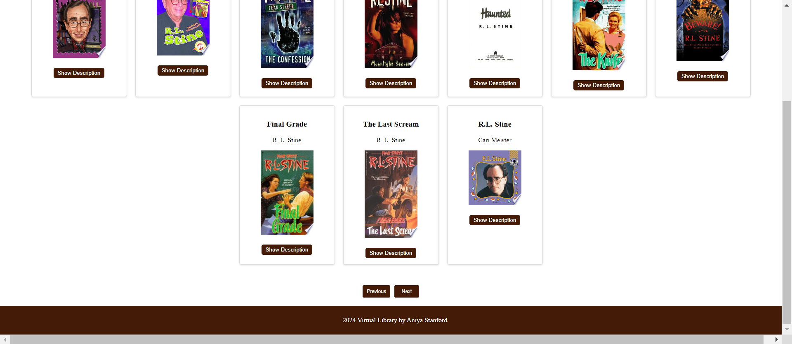

## Virtual Library by Aniya Stanford

## Description
This project is a virtual library web application. The application allows users to search for books, view details, and navigate through multiple pages of search results. Additionally, this project integrates the Google Books API to fetch and display book information dynamically.

## Table of Contents
- [Installation](#installation)
- [Usage](#usage)
- [Contributing](#contributing)
- [License](#license)
- [Contact](#contact)

## Installation
1. Clone the repository:
   ```bash
   git clone https://github.com/username/repository-name.git
2. Navigate to the project directory:
    ```bash
   cd repository-name
4. Install dependencies:
    ```bash
   npm install

## Usage
My portfolio is designed to be simple and user-friendly.

## Screenshots





